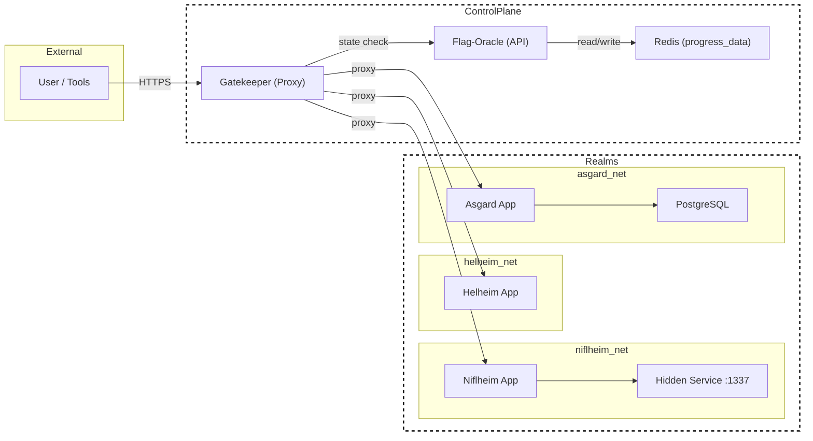

```mermaid
flowchart LR
  subgraph External
    U["User / Tools"]
  end

  subgraph ControlPlane
    GK["Gatekeeper (Proxy)"]
    FO["Flag-Oracle (API)"]
    R["Redis (progress_data)"]
  end

  subgraph Realms
    subgraph niflheim_net
      N1["Niflheim App"]
      N2["Hidden Service :1337"]
    end
    subgraph helheim_net
      H1["Helheim App"]
    end
    subgraph asgard_net
      A1["Asgard App"]
      A2["PostgreSQL"]
    end
  end

  U -->|HTTPS| GK
  GK -->|state check| FO
  FO -->|read/write| R

  GK -->|proxy| N1
  N1 --> N2
  GK -->|proxy| H1
  GK -->|proxy| A1
  A1 --> A2

  classDef boundary fill:#fff,stroke:#000,stroke-width:2px,stroke-dasharray: 5 5;
  class ControlPlane,Realms boundary;

```
